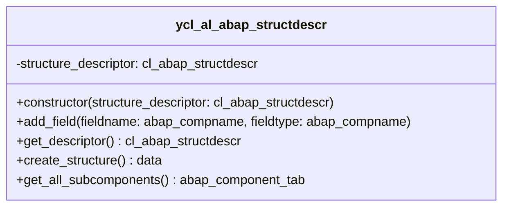

# YAL_DDIC Package Documentation
The YAL_DDIC package contains all utility objects relating to the data dictionary.

## Components
| **Object**                                          | **Description**                                                           |
|-----------------------------------------------------|---------------------------------------------------------------------------|
| [YCL_AL_ABAP_STRUCTDESCR](YCL_AL_ABAP_STRUCTDESCR)  | This class enhances the standard CL_ABAP_STRUCTDESCR class. Most notably to 'get all subcomponents'             |
| [YST_AL_ADMIN_FIELDS](YST_AL_ADMIN_FIELDS)          | This structure provides an easily re-used bundle of fields: createdBy, createdAt, etc.. |

## YCL_AL_ABAP_STRUCTDESCR
The YCL_AL_ABAP_STRUCTDESCR enhances the standard CL_ABAP_STRUCTDESCR by providing additionaly functionality.
Most notably the "get_all_subcomponents" method retrieves all fields of a **deep** structure, essentially flattening it.

## YST_AL_ADMIN_FIELDS
A structure that can be added as an include to easily add the following fields to another DDIC-object:
 - CreatedBy
 - CreatedAt
 - LastChangedBy
 - LastChangedAt
 - LocalLastChangedAt
