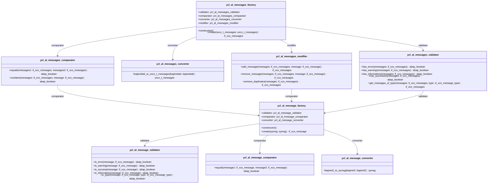

## Mermaid UML Diagram

# ABAP Classes Documentation

This documentation provides an overview of the ABAP classes and their relationships as depicted in the Mermaid UML diagram.

## Classes Overview

### ycl_al_message_comparator
This class is responsible for comparing two messages.

- **Methods:**
  - `equals(message1: if_xco_message, message2: if_xco_message)`: Compares two messages and returns a boolean result.

### ycl_al_message_converter
This class converts BAPI return structures to system messages.

- **Methods:**
  - `bapiret2_to_symsg(bapiret2: bapiret2)`: Converts a BAPI return structure to a system message.

### ycl_al_message_factory
This class creates and manages message-related objects.

- **Attributes:**
  - `validator`: Reference to `ycl_al_message_validator`
  - `comparator`: Reference to `ycl_al_message_comparator`
  - `converter`: Reference to `ycl_al_message_converter`

- **Methods:**
  - `constructor()`: Initializes the factory with validator, comparator, and converter.
  - `create(symsg: symsg)`: Creates a message object from a system message.

### ycl_al_message_validator
This class validates different types of messages.

- **Methods:**
  - `is_error(message: if_xco_message)`: Checks if a message is an error.
  - `is_warning(message: if_xco_message)`: Checks if a message is a warning.
  - `is_success(message: if_xco_message)`: Checks if a message is a success.
  - `is_information(message: if_xco_message)`: Checks if a message is informational.
  - `is_type(message: if_xco_message, type: cl_xco_message_type)`: Checks if a message is of a specific type.

### ycl_al_messages_comparator
This class compares collections of messages.

- **Methods:**
  - `equals(messages1: if_xco_messages, messages2: if_xco_messages)`: Compares two collections of messages.
  - `contains(messages: if_xco_messages, message: if_xco_message)`: Checks if a collection contains a specific message.

### ycl_al_messages_converter
This class converts BAPI return tables to collections of system messages.

- **Methods:**
  - `bapirettab_to_sxco_t_messages(bapirettab: bapirettab)`: Converts a BAPI return table to a collection of system messages.

### ycl_al_messages_factory
This class creates and manages collections of message-related objects.

- **Attributes:**
  - `validator`: Reference to `ycl_al_messages_validator`
  - `comparator`: Reference to `ycl_al_messages_comparator`
  - `converter`: Reference to `ycl_al_messages_converter`
  - `modifier`: Reference to `ycl_al_messages_modifier`

- **Methods:**
  - `constructor()`: Initializes the factory with validator, comparator, converter, and modifier.
  - `create(sxco_t_messages: sxco_t_messages)`: Creates a collection of message objects from a collection of system messages.

### ycl_al_messages_modifier
This class modifies collections of messages.

- **Methods:**
  - `add_message(messages: if_xco_messages, message: if_xco_message)`: Adds a message to a collection.
  - `remove_message(messages: if_xco_messages, message: if_xco_message)`: Removes a message from a collection.
  - `remove_duplicates(messages: if_xco_messages)`: Removes duplicate messages from a collection.

### ycl_al_messages_validator
This class validates collections of messages.

- **Methods:**
  - `has_errors(messages: if_xco_messages)`: Checks if a collection has error messages.
  - `has_warnings(messages: if_xco_messages)`: Checks if a collection has warning messages.
  - `has_informations(messages: if_xco_messages)`: Checks if a collection has informational messages.
  - `has_successes(messages: if_xco_messages)`: Checks if a collection has success messages.
  - `get_messages_of_type(messages: if_xco_messages, type: cl_xco_message_type)`: Gets messages of a specific type from a collection.

## Relationships

- `ycl_al_message_factory` has references to `ycl_al_message_validator`, `ycl_al_message_comparator`, and `ycl_al_message_converter`.
- `ycl_al_messages_factory` has references to `ycl_al_messages_validator`, `ycl_al_messages_comparator`, `ycl_al_messages_converter`, and `ycl_al_messages_modifier`.
- `ycl_al_messages_comparator` and `ycl_al_messages_modifier` use `ycl_al_message_factory` for comparison operations.
- `ycl_al_messages_validator` uses `ycl_al_message_factory` for validation operations.
