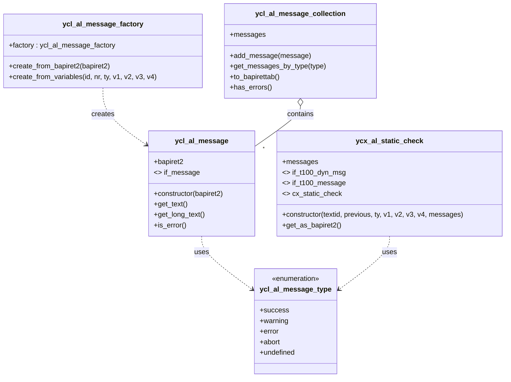

```mermaid
%%{init: {'theme': 'base', 'themeVariables': {
    'primaryColor': '#1E90FF',     // Capgemini blue
    'primaryTextColor': '#FFFFFF', // White text
    'lineColor': '#4D4D4D',        // Dark gray for lines
    'secondaryColor': '#F0F0F0',   // Light gray for backgrounds
    'tertiaryColor': '#0070AD'     // Darker Capgemini blue for highlights
}}}%%
classDiagram
    class ycl_al_message_factory {
        +factory : ycl_al_message_factory
        +create_from_bapiret2(bapiret2)
        +create_from_variables(id, nr, ty, v1, v2, v3, v4)
    }
    class ycl_al_message {
        +bapiret2
        +constructor(bapiret2)
        +get_text()
        +get_long_text()
        +is_error()
        <<interface>> if_message
    }
    class ycl_al_message_type {
        <<enumeration>>
        +success
        +warning
        +error
        +abort
        +undefined
    }
    class ycx_al_static_check {
        +messages
        +constructor(textid, previous, ty, v1, v2, v3, v4, messages)
        +get_as_bapiret2()
        <<interface>> if_t100_dyn_msg
        <<interface>> if_t100_message
        <<inherit>> cx_static_check
    }
    class ycl_al_message_collection {
        +messages
        +add_message(message)
        +get_messages_by_type(type)
        +to_bapirettab()
        +has_errors()
    }
    ycl_al_message_factory ..> ycl_al_message: creates
    ycl_al_message_collection o-- "*" ycl_al_message: contains
    ycl_al_message ..> ycl_al_message_type: uses
    ycx_al_static_check ..> ycl_al_message_type: uses
```
