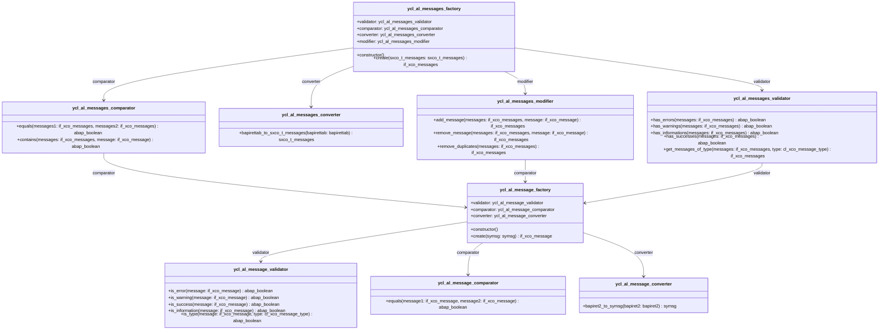

## Mermaid UML Diagram

Sure! Here is the updated markdown documentation with a table of contents and method parameters along with their types:

# ABAP Messaging Demo Class Documentation

This documentation provides examples of how to use the messaging classes in ABAP, as demonstrated in the `ycl_al_messaging_demo` class.

## Table of Contents

- [create_message](#create_message)
- create_message_from_bapiret2
- is_message_error
- create_messages
- create_messages_frm_bapirettab
- messages_has_error
- get_errors
- add_message
- remove_message
- get_bapiret2
- get_bapirettab
- get_symsg
- get_sxco_t_messages

## Class: ycl_al_messaging_demo

### Methods

#### create_message

Creates a message using the `ycl_al_message_factory`.

**Parameters:**
- None

```abap
METHOD create_message.
  result = NEW ycl_al_message_factory( )->create( get_symsg( ) ).
  " Alternatively
  result = xco_cp=>message( get_symsg( ) ).
ENDMETHOD.
```

#### create_message_from_bapiret2

Creates a message from a BAPI return structure.

**Parameters:**
- None

```abap
METHOD create_message_from_bapiret2.
  DATA(message_factory) = NEW ycl_al_message_factory( ).
  result = message_factory->create( message_factory->converter->bapiret2_to_symsg( get_bapiret2( ) ) ).
ENDMETHOD.
```

#### is_message_error

Checks if a message is an error.

**Parameters:**
- None

```abap
METHOD is_message_error.
  NEW ycl_al_message_factory( )->validator->is_error( create_message( ) ).
ENDMETHOD.
```

#### create_messages

Creates a collection of messages.

**Parameters:**
- None

```abap
METHOD create_messages.
  result = NEW ycl_al_messages_factory( )->create( get_sxco_t_messages( ) ).
  " Alternatively
  result = xco_cp=>messages( get_sxco_t_messages( ) ).
ENDMETHOD.
```

#### create_messages_frm_bapirettab

Creates a collection of messages from a BAPI return table.

**Parameters:**
- None

```abap
METHOD create_messages_frm_bapirettab.
  DATA(messages_factory) = NEW ycl_al_messages_factory( ).
  result = messages_factory->create( messages_factory->converter->bapirettab_to_sxco_t_messages( get_bapirettab( ) ) ).
ENDMETHOD.
```

#### messages_has_error

Checks if a collection of messages contains any errors.

**Parameters:**
- None

```abap
METHOD messages_has_error.
  result = NEW ycl_al_messages_factory( )->validator->has_errors( create_messages( ) ).
ENDMETHOD.
```

#### get_errors

Gets all error messages from a collection.

**Parameters:**
- None

```abap
METHOD get_errors.
  result = NEW ycl_al_messages_factory( )->validator->get_messages_of_type( messages = create_messages( )
    type = xco_cp_message=>type->error ).
ENDMETHOD.
```

#### add_message

Adds a message to a collection.

**Parameters:**
- None

```abap
METHOD add_message.
  result = NEW ycl_al_messages_factory( )->modifier->add_message( messages = create_messages( )
    message = create_message( ) ).
ENDMETHOD.
```

#### remove_message

Removes a message from a collection.

**Parameters:**
- None

```abap
METHOD remove_message.
  result = NEW ycl_al_messages_factory( )->modifier->remove_message( messages = create_messages( )
    message = create_message( ) ).
ENDMETHOD.
```

### Helper Methods

#### get_bapiret2

Returns a sample BAPI return structure.

**Parameters:**
- None

```abap
METHOD get_bapiret2.
  result = VALUE #( id = 'MyMessageClass'
    number = '000'
    type = xco_cp_message=>type->error->value
    message_v1 = 'MyMessageVariable1' ).
ENDMETHOD.
```

#### get_bapirettab

Returns a sample BAPI return table.

**Parameters:**
- None

```abap
METHOD get_bapirettab.
  result = VALUE #( ( get_bapiret2( ) )
    ( get_bapiret2( ) ) ).
ENDMETHOD.
```

#### get_symsg

Returns a sample system message.

**Parameters:**
- None

```abap
METHOD get_symsg.
  result = VALUE #( msgid = 'MyMessageClass'
    msgno = '000'
    msgty = xco_cp_message=>type->error->value
    msgv1 = 'MyMessageVariable1' ).
ENDMETHOD.
```

#### get_sxco_t_messages

Returns a sample collection of system messages.

**Parameters:**
- None

```abap
METHOD get_sxco_t_messages.
  result = VALUE #( ( create_message( ) )
    ( create_message( ) ) ).
ENDMETHOD.
```
