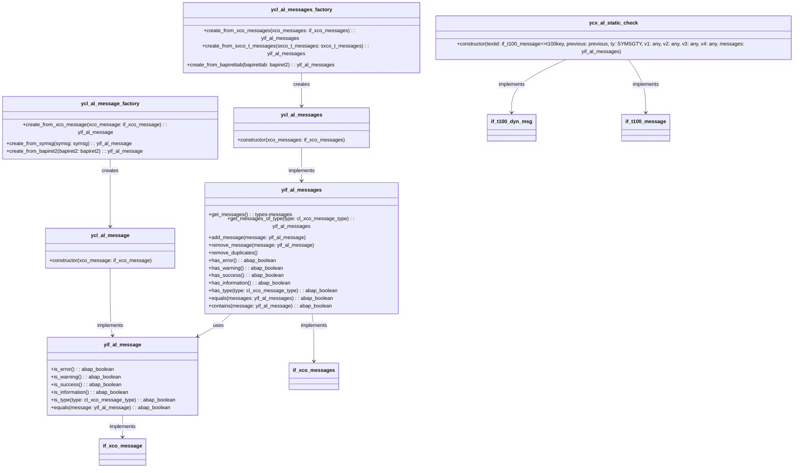

## Mermaid UML Diagram


# ABAP Messaging Examples
This documentation provides examples of how to use the messaging classes in ABAP.
## Table of Contents
### Single message
- [create_message](#create_message)
- [create_message_from_bapiret2](#create_message_from_bapiret2)
- [is_message_error](#is_message_error)
### Message collection
- [create_messages](#create_messages)
- [create_messages_from_bapirettab](#create_messages_frm_bapirettab)
- [messages_has_error](#messages_has_error)
- [get_errors](#get_errors)
- [add_message](#add_message)
- [remove_message](#remove_message)
#### Helper methods for examples
- [get_bapiret2](#get_bapiret2)
- [get_bapirettab](#get_bapirettab)
- [get_symsg](#get_symsg)
- [get_sxco_t_messages](#get_sxco_t_messages)

## Methods
### create_message

Creates a message using the `ycl_al_message_factory`.
Returns an instance of yif_al_message
```abap
METHOD create_message.
  result = NEW ycl_al_message_factory( )->create_from_symsg( get_symsg( ) ).
ENDMETHOD.
```

### create_message_from_bapiret2

Creates a message from a BAPIRET2 return structure.
Returns an instance of yif_al_message
```abap
METHOD create_message_from_bapiret2.
  result = NEW ycl_al_message_factory( )->create_from_bapiret2( get_bapiret2( ) ).
ENDMETHOD.
```

### is_message_error

Checks if a message is an error.
Returns a boolean
```abap
METHOD is_message_error.
  create_message( )->is_error( ).
ENDMETHOD.
```

### create_messages

Creates a collection of messages.
Returns an instance of yif_al_messages
```abap
METHOD create_messages.
  result = NEW ycl_al_messages_factory( )->create_from_sxco_t_messages( get_sxco_t_messages( ) ).
ENDMETHOD.
```

### create_messages_from_bapirettab

Creates a collection of messages from a BAPIRETTAB return table.
Returns an instance of yif_al_messages
```abap
METHOD create_messages_frm_bapirettab.
  result = NEW ycl_al_messages_factory( )->create_from_bapirettab( get_bapirettab( ) ).
ENDMETHOD.
```

### messages_has_error
Checks if a collection of messages contains any errors.
Returns a boolean
```abap
METHOD messages_has_error.
  result = create_messages( )->has_errors( ).
ENDMETHOD.
```

### get_errors
Gets all error messages from a collection.
Returns an instance of yif_al_messages
```abap
METHOD get_errors.
  result = create_messages( )->get_messages_of_type( xco_cp_message=>type->error ).
ENDMETHOD.
```

### add_message

Adds a message to a collection.
```abap
METHOD add_message.
  create_messages( )->add_message( create_message ).
ENDMETHOD.
```

### remove_message

Removes a message from a collection.
```abap
METHOD remove_message.
  create_messages( )->remove_message( create_message ).
ENDMETHOD.
```

## Helper Methods

### get_bapiret2

Returns a sample BAPIRET2 structure.

```abap
METHOD get_bapiret2.
  result = VALUE #( id = 'MyMessageClass'
    number = '000'
    type = xco_cp_message=>type->error->value
    message_v1 = 'MyMessageVariable1' ).
ENDMETHOD.
```

### get_bapirettab

Returns a sample BAPIRETTAB table.

```abap
METHOD get_bapirettab.
  result = VALUE #( ( get_bapiret2( ) )
    ( get_bapiret2( ) ) ).
ENDMETHOD.
```

### get_symsg

Returns a sample system message.

```abap
METHOD get_symsg.
  result = VALUE #( msgid = 'MyMessageClass'
    msgno = '000'
    msgty = xco_cp_message=>type->error->value
    msgv1 = 'MyMessageVariable1' ).
ENDMETHOD.
```

### get_sxco_t_messages

Returns a sample collection of system messages.

```abap
METHOD get_sxco_t_messages.
  result = VALUE #( ( create_message( ) )
    ( create_message( ) ) ).
ENDMETHOD.
```
