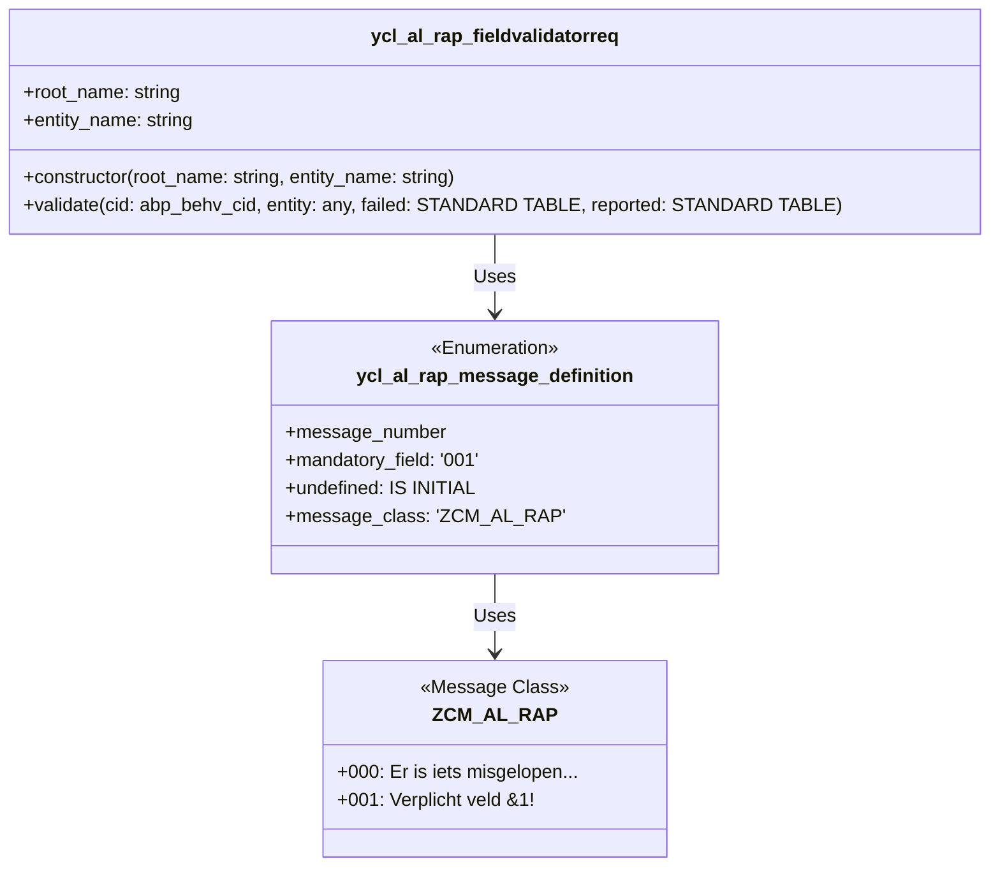

The `ycl_al_rap_fieldvalidatorreq` class validates whether all mandatory fields of a RAP-object are filled in.
It reports the relevant error messages in case fields are missing.

The `ycl_al_rap_message_definition` class enumerates the message numbers and their corresponding message class for RAP-related messages.

